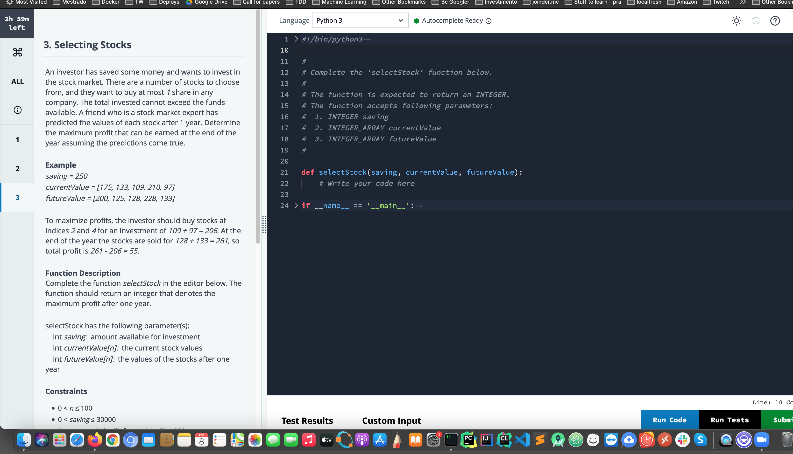

# Cost of transaction 

An investor has saved some money and wants to invest in the stock market. There are a numver of stocls to choose from, and the want to buy at most 1 share in any company. The total invested cannot exceed the funds avaliable. A friend who is a stocker market expert has predcited the values of each stocker after 1 year. Determine the maximun profit that can be earned at the end of the year assuming the predictions come true.




To execute, run on terminal:

```py
python3 -m unittest
```


